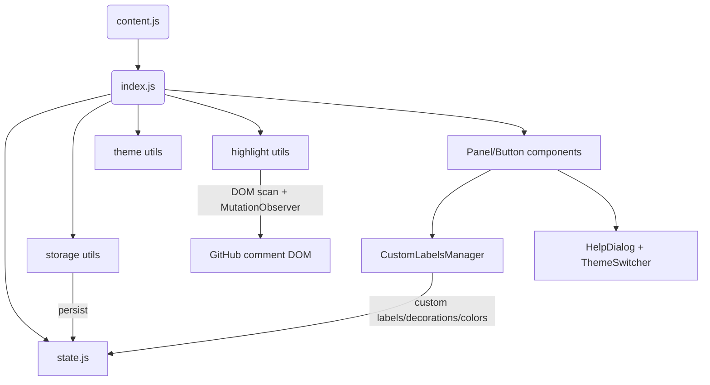

# Conventional Comments for GitHub

A browser extension that adds a floating panel for quickly inserting Conventional Comments on GitHub pull requests, issues, discussions, and inline review threads (Files tab included). Highlights existing comments that follow the convention.

## About Conventional Comments

[Conventional Comments](https://conventionalcomments.org/) is a labeling system for code review comments to make feedback more effective:

- **praise:** highlights something positive
- **nitpick:** trivial preference-based requests
- **suggestion:** specific, actionable recommendations
- **issue:** specific problems that require addressing
- **todo:** tracked tasks or to-do items
- **question:** requests for clarification or understanding
- **thought:** ideas, not requiring action
- **chore:** necessary but mundane tasks
- **note:** neutral observations

Additional modifiers can specify the comment's importance:

- **non-blocking:** doesn't need to be resolved to proceed
- **blocking:** must be resolved before merging
- **if-minor:** only address if it's a simple change


## Features

- Floating “CC” button + draggable panel that remembers its position; Alt+C toggles visibility.
- Auto-detects the focused GitHub editor (conversation, inline diff comments, issues, discussions); updates when you change focus.
- One-click label insertion; decoration toggles that update the existing label in place.
- Custom labels/decorations with persistence, plus per-label/per-decoration highlight colors (🎨 button) with sane defaults.
- Highlights Conventional Comments in Conversation and Files tabs using the same color palette.
- Theme-aware UI (light/dark/system) with no external network requests or analytics.

## Installation

### From Browser Stores

- Chrome: [Chrome Web Store](https://chrome.google.com/webstore/detail/...)
- Firefox: [Firefox Add-ons](https://addons.mozilla.org/en-US/firefox/addon/...)

### Manual Installation

1. Download the latest release from the Releases page
2. Chrome:
   - Go to `chrome://extensions/`
   - Enable "Developer mode"
   - Click "Load unpacked" and select the downloaded folder
3. Firefox:
   - Go to `about:debugging#/runtime/this-firefox`
   - Click "Load Temporary Add-on"
   - Select the `manifest.json` file from the downloaded folder

## Usage

1. On any GitHub page with comment fields, look for the floating "CC" button in the bottom right
2. Click it to open the Conventional Comments panel
3. Select a text field to comment in (click in it to make it active)
4. Click a label (e.g., "suggestion") to insert it into your comment
5. Add optional decorations (e.g., "non-blocking") by clicking them
6. The panel can be dragged anywhere on the screen
7. Use Alt+C to quickly show/hide the panel

## Quick Start

```bash
pnpm install          # install deps
pnpm dev              # watch build for local development
pnpm build            # production bundle to dist/
pnpm debug            # dev build without watch
```

Load `dist/` as an unpacked extension (Chrome/Edge) or use `manifest.json` for Firefox temporary add-on. The build pipeline uses webpack (babel-loader, css-loader, terser, zip-webpack-plugin) to produce `dist/content.js`, copy CSS/icons/manifest, and zip as `dist/conventional-comments-extension.zip`.

## Usage

1. Click in any GitHub comment box; the panel tracks the active field. 2) Toggle with Alt+C or the “CC” button. 3) Pick a label; add decorations as needed—chips update in-place. 4) Customize labels/decorations or their highlight colors via the “+” and 🎨 controls. 5) Drag the panel; position and expansion state persist.

## Architecture

- Entry: `src/index.js` initializes theme, custom data, focus listeners, highlighting, and panel/button creation.
- UI: `src/components/` (Panel, Button, HelpDialog, ThemeSwitcher, CustomLabelsManager) plus `styles.css` and companion CSS files.
- State/Utilities: `src/state.js`, `src/utils/` (storage for persistence, highlight for comment coloring, theme helpers, interactions, constants).
- Build: `webpack.config.js` bundles `src/content.js` (imports `src/index.js`).
- Distribution: artifacts live in `dist/` after build.



## Permissions & Privacy

- Permissions: `storage` plus content scripts scoped to `github.com/*` pull requests, issues, discussions, and commits. No host permissions beyond GitHub; no network requests or external analytics.
- Data: labels, decorations, colors, and UI positions are stored locally via `chrome.storage`/`localStorage`.

## License

GPL-3.0-or-later - see [LICENSE](./LICENSE) for full terms.

## Credits

- [Conventional Comments](https://conventionalcomments.org/) for the commenting standard
- Icons from [feather icons](https://feathericons.com/)

---

If you find this project useful, please consider supporting it! I accept donations through either [BuyMeACoffee](https://buymeacoffee.com/CoMfUcIoS) or [GitHub Sponsors](https://github.com/sponsors/CoMfUcIoS).
Your contributions help in maintaining and improving this extension. Thank you for your support!
